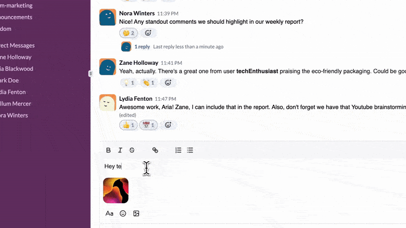

🚀 Slack Clone

A feature-rich Slack clone built with Next.js 15, React, Tailwind CSS, ShadCN, Zustand, and Convex. This project replicates core Slack functionalities, providing an intuitive and seamless team communication experience.

🌟 Features

🔹 Real-time messaging using Convex

🔹 Channel management (create, join, and leave channels)

🔹 Responsive UI with Tailwind CSS & ShadCN components

🔹 Dark mode support

🔹 File uploads for seamless media sharing

🔹 Optimized for performance with Next.js 15

🛠️ Tech Stack

Frontend: Next.js 15, React, TypeScript, ShadCN, Tailwind CSS

State Management: Zustand

Backend & Database: Convex

Real-time Communication: Convex

Authentication: @auth/core

🌍 Live Demo

Check out the live version of this project:

🔗 [Slack Clone Live](https://slack-clone-rho-ten.vercel.app)

🚀 Getting Started

Prerequisites

Node.js 18+

Package manager (npm, yarn, or pnpm)

Installation

# Clone the repository

git clone https://github.com/mjfallah/slack-clone.git
cd slack-clone

# Install dependencies

yarn install # or npm install or pnpm install

Environment Variables

Create a .env.local file and configure it with the required API keys:

NEXT_PUBLIC_AUTH_SECRET=your-auth-secret
CONVEX_DEPLOY_KEY=your-convex-deploy-key

Running the Project

# Start the development server

yarn dev # or npm run dev or pnpm dev

The app should now be running on http://localhost:3000.

📸 Feature Preview

🤝 Contributing

Pull requests are welcome! For major changes, please open an issue first to discuss what you’d like to change.

📜 License

This project is licensed under the MIT License - see the LICENSE file for details.

🎉 Thank you for checking out this project! Feel free to give a ⭐ if you find it useful!
